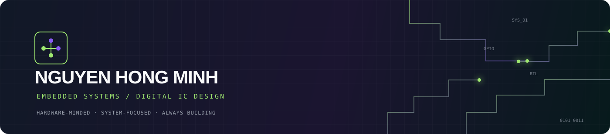

<div align="center">



<br />

<a href="https://github.com/ngminhpd"></a>


</div>

<br />

## Nguyen Hong Minh

### Embedded systems engineer in progress.

I work at the intersection of **electronics, firmware, and digital hardware** — turning
block diagrams into systems that can be measured, debugged, and used in the real world.

Currently studying **Computer & Embedded Systems** at the University of Science, HCMUS,
with a long-term focus on embedded products and IC design.

<br />

<table>
<tr>
<td width="33%" valign="top">

#### 01 / BUILD

Embedded devices<br />
Robotics & automation<br />
Hardware prototypes

</td>
<td width="33%" valign="top">

#### 02 / DESIGN

Digital logic & RTL<br />
PCB and system architecture<br />
Hardware–software interfaces

</td>
<td width="33%" valign="top">

#### 03 / IMPROVE

Verification-first thinking<br />
Reliable communication<br />
Clear technical documentation

</td>
</tr>
</table>

<br />

## Core stack

<table>
<tr>
<td><b>MICROCONTROLLERS</b></td>
<td>STM32 · ESP32 · RP2040</td>
</tr>
<tr>
<td><b>FIRMWARE</b></td>
<td>C · C++ · UART · GPIO · PWM · USB HID · Audio</td>
</tr>
<tr>
<td><b>DIGITAL IC</b></td>
<td>Verilog · RTL simulation · Yosys · OpenROAD · OpenLane2</td>
</tr>
<tr>
<td><b>HARDWARE</b></td>
<td>KiCad · PCB design · Sensors · Displays · Motor control</td>
</tr>
<tr>
<td><b>SYSTEMS</b></td>
<td>MQTT · MES · Linux · Git · Hardware–software integration</td>
</tr>
</table>

<br />

## Current signal

```text
FOCUS       Embedded C · Digital IC design · Reliable hardware systems
LEARNING    RTL-to-GDS flow · Verification · Real-time firmware architecture
BUILDING    Interactive devices · Robotics · Open-source silicon workflows
LOCATION    Ho Chi Minh City, Vietnam
```

## Engineering principles

> Make the interface clear. Make the behavior measurable. Make failure recoverable.

I care about the details between the boxes: timing, communication boundaries, power,
debugging hooks, and what happens when the system does not behave as expected.

<br />

## GitHub activity

<div align="center">


</div>

<br />

<div align="center">

<a href="https://github.com/ngminhpd?tab=repositories">Explore repositories</a>
&nbsp;&nbsp;·&nbsp;&nbsp;
<a href="https://github.com/ngminhpd">Connect on GitHub</a>

<br /><br />

<sub>BUILD WITH INTENT · TEST WITH EVIDENCE · DOCUMENT WITH CLARITY</sub>

</div>
