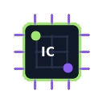
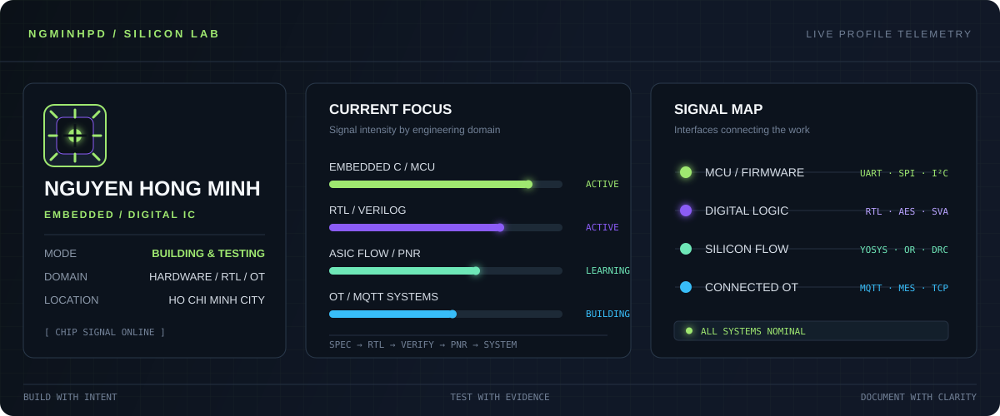

<div align="center">


<br />



<br />

<a href="https://github.com/ngminhpd"></a>


</div>

<br />

<div align="center">



</div>

<br />

<table>
<tr>
<td width="33%" valign="top">

#### 🟢 SYSTEM STATUS

**MODE**<br />
Building & testing

**LAB**<br />
Embedded · RTL · Hardware

**LOCATION**<br />
Ho Chi Minh City, Vietnam

</td>
<td width="33%" valign="top">

#### 🧬 DESIGN DOMAIN

Digital IC & ASIC flow<br />
Embedded firmware<br />
Robotics & connected devices<br />
Hardware–software integration

</td>
<td width="33%" valign="top">

#### 📡 LIVE SIGNAL

`UART` · `SPI` · `I²C`<br />
`MQTT` · `MES` · `TCP/IP`<br />
`RTL → GDSII` workflow

</td>
</tr>
</table>

<br />

## ⚡ Nguyen Hong Minh

### Embedded systems engineer in progress.

I work at the intersection of **electronics, firmware, and digital hardware** — turning
block diagrams into systems that can be measured, debugged, and used in the real world.

Currently studying **Computer & Embedded Systems** at the University of Science, HCMUS,
with a long-term focus on embedded products and IC design.

<br />

## 🧰 Toolchain / signal path

<table>
<tr>
<td><b>EMBEDDED</b></td>
<td>STM32 · ESP32 · RP2040 · C · C++ · FreeRTOS concepts</td>
</tr>
<tr>
<td><b>DIGITAL IC</b></td>
<td>Verilog · RTL simulation · Yosys · OpenROAD · OpenLane2</td>
</tr>
<tr>
<td><b>ASIC FLOW</b></td>
<td>Floorplan · Placement · CTS · Routing · DRC/LVS · GDSII</td>
</tr>
<tr>
<td><b>HARDWARE</b></td>
<td>KiCad · PCB design · Sensors · Displays · Motor control</td>
</tr>
<tr>
<td><b>CONNECTED SYSTEMS</b></td>
<td>MQTT · MES · Linux · Git · Real-time telemetry</td>
</tr>
</table>

<br />

## 🧪 Current experiments

```text
01  RTL / AES-128                 encryption core, simulation, synthesis
02  Open-source ASIC              RTL-to-GDS experimentation with OpenLane2
03  Embedded systems              MCU firmware, sensors, displays, device control
04  OT / IIoT integration         MQTT telemetry and printer-control interfaces
```

<br />

## 🧠 Engineering principles

> Make the interface clear. Make the behavior measurable. Make failure recoverable.

I care about the details between the boxes: timing, communication boundaries, power,
debugging hooks, and what happens when the system does not behave as expected.

<br />

## 🔗 Signal sources

<a href="https://github.com/ngminhpd/AES128"></a>
<a href="https://github.com/Purin1410/mes-demo"></a>

<br /><br />

## 📊 GitHub activity

The contribution graph below tracks the systems I build across electronics, firmware,
digital logic, and hardware–software integration.

<div align="center">

<a href="https://github.com/ngminhpd?tab=repositories">Explore repositories</a>
&nbsp;&nbsp;·&nbsp;&nbsp;
<a href="https://github.com/ngminhpd">Connect on GitHub</a>

<br /><br />

<sub>BUILD WITH INTENT · TEST WITH EVIDENCE · DOCUMENT WITH CLARITY</sub>

</div>
